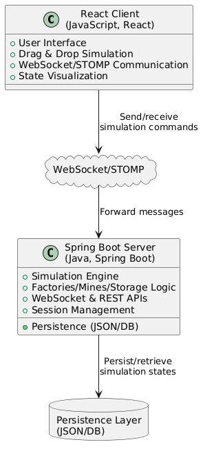

# Large-Scale Production Simulation

A modular, discrete-event production simulation platform for modeling complex supply chains and factory systems, built with Java (Spring Boot) and React.

## Overview

This project simulates large-scale production environments—factories, mines, storage units, waste facilities, and drone logistics—using a configurable, cycle-based discrete-event engine. It provides both textual and graphical user interfaces, real-time client-server communication, and robust session management for state persistence and replay.

## Key Features

### Discrete-Event Engine

* Configurable simulation: Model factories, mines, storage, and logistics via JSON-based config files.

* Recipe & ingredient validation: Automatic checks for production feasibility and resource constraints.

* Dynamic queues & latency-aware routing: Efficient management of requests, with simulated transport and road-network latencies.

### Client-Server Architecture

* Spring Boot backend: Supports multiple clients via WebSocket/STOMP.

* Real-time state persistence: Save and load full simulation states using JSON serialization.

* Session management: Robust concurrent user and simulation session handling.




### User Interfaces

* Command-line client (Java): Picocli/Jackson-based CLI supporting request management, simulation stepping, and state persistence.

* Graphical interface (React): Interactive drag-and-drop for buildings, road/path visualization, real-time connectivity/status updates, and tooltips.

### Advanced Simulation Features

* Smart storage: Priority-based restocking, accurate capacity tracking, and negative-inventory (backorder) queues.

* Waste disposal: Integrated asynchronous waste handling into production flows.

* Drone logistics: Configurable ports with radius/speed for fast item transfer (supports both drone and road-based routing).

* Dynamic runtime management: Create/remove buildings and connections with on-the-fly network re-routing for efficiency.

## Quality Assurance & Tooling

* 95%+ Javadoc and unit-test coverage with JUnit 5, Mockito, Clover.

* Gradle CI/CD pipeline: Automated build, test, and deployment.

* Modular, scalable design: Spring Messaging, Scheduling, Hikari/JPA for future expansion.

## Tech Stack

* Backend: Java 17, Spring Boot, WebSocket, STOMP, Hikari, JPA

* Frontend: React, SockJS, STOMP over WebSocket, Material UI

* Docker: Containerized deployment for both backend and frontend

* Testing: JUnit 5, Mockito, Clover

* Build/CI: Gradle, GitLab CI/CD

## Getting Started - Prerequisites

* Java 17+

* Node.js & npm (for frontend)

* Gradle

## Setup

1. Clone the repository

```sh

git clone https://gitlab.com/your-org/large-scale-simulation.git
cd large-scale-simulation
```

2. Backend

```sh

cd backend
./gradlew build
./gradlew bootRun
```

3. Frontend

```sh

cd frontend
npm install
npm start
```

4. Docker (optional)

```sh
docker-compose up --build
```

5. Testing

```sh

./gradlew test
```

6. Usage

Configure simulation scenarios via JSON files in /configs

Connect by launching the React web interface at localhost:3000 or the CLI client (java -jar cli-client.jar).   

Use REST/WebSocket endpoints as documented in the API docs